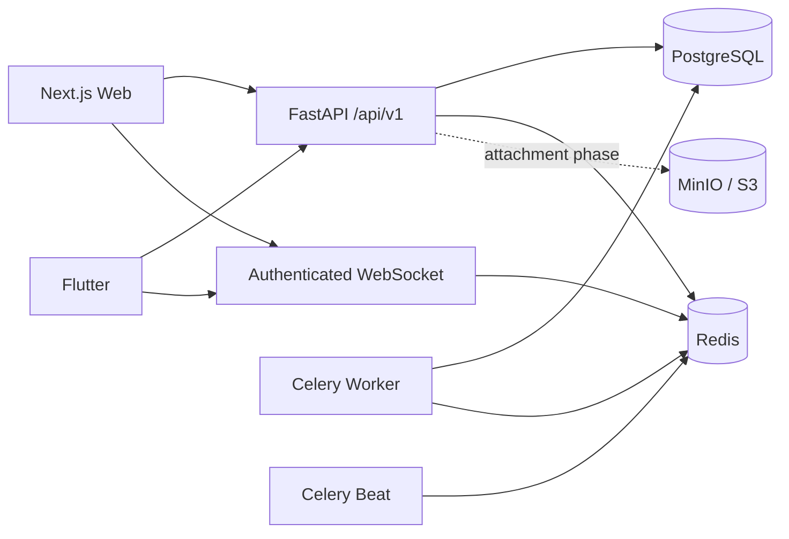

# TaskPilot

TaskPilot is a collaborative project and task management platform for individuals and teams. It combines structured projects, Kanban workflows, task discussion, realtime activity, notifications, analytics, and a native mobile client in one portfolio-grade SaaS codebase.

## What is implemented now

This repository contains a working first production slice rather than a mockup:

- Next.js web application with registration/login, persistent web sessions, workspace/project navigation, dark mode, project creation, responsive Kanban board, task creation, and optimistic drag-to-column moves.
- Flutter mobile application with native Material 3 UI, login/registration, secure token storage, refresh-token rotation, workspace loading, offline workspace cache, system dark mode, and Android CI builds.
- FastAPI backend with versioned REST API, OpenAPI docs, PostgreSQL, Redis, Alembic, Argon2 password hashing, short-lived JWT access tokens, opaque hashed refresh sessions, session rotation/revocation, and workspace authorization enforced server-side.
- Core collaboration model: workspaces, members, invitation schema, projects, five-column boards, readable task identifiers, task optimistic locking/versioning, comments, labels/assignee schemas, activity logs, notifications, project analytics, permission-aware global search, and admin metrics.
- Realtime workspace channel over authenticated WebSockets backed by Redis pub/sub. Task create/update/move and comment creation publish realtime events.
- Celery worker + Celery Beat. The first scheduled job creates idempotency-windowed deadline notifications for assigned tasks due within 24 hours.
- Docker Compose for PostgreSQL, Redis, MinIO, API, worker, beat scheduler, and web.
- GitHub Actions for backend lint/tests, Next.js typecheck/build, Flutter analyze/tests, release APK, release AAB, and downloadable Android artifacts.

Advanced product areas that are not complete yet are explicitly tracked in **Roadmap** below; they are not represented as finished features.

## Architecture



More detail: [`docs/ARCHITECTURE.md`](docs/ARCHITECTURE.md).

## Repository layout

```text
TaskPilot/
├── backend/              FastAPI API, SQLAlchemy models, Alembic, Celery, tests
├── web/                  Next.js + TypeScript + Tailwind + TanStack Query + dnd-kit
├── mobile/               Flutter + Riverpod + Dio + GoRouter + secure/offline storage
├── docs/                 Architecture and engineering notes
├── .github/workflows/    CI and Android build pipeline
├── docker-compose.yml    Local multi-service environment
├── .env.example          Safe configuration template
└── Makefile              Common local commands
```

## Core backend behavior

### Authentication

- Passwords are hashed with Argon2.
- Access tokens are short-lived JWTs.
- Refresh tokens are random opaque values and only their SHA-256 digests are stored.
- Refresh tokens rotate on every refresh.
- Web refresh tokens use HttpOnly cookies.
- Mobile refresh/access tokens use platform secure storage.
- Revoked/expired sessions cannot mint new access tokens.

### Authorization and isolation

Workspace membership is resolved on the server for workspace-scoped operations. Project/task IDs do not grant access by themselves. Admin endpoints separately require the platform `is_admin` flag.

### Collaborative task updates

Tasks have an integer `version`. Update/move endpoints compare the supplied version and return HTTP 409 if another collaborator changed the task first. This keeps optimistic UI fast without silently overwriting concurrent edits.

### Realtime

Workspace WebSocket connections authenticate with an access token and verify membership before subscribing to the Redis workspace channel. API mutations publish task/comment events to that channel.

## Local setup

Requirements:

- Docker + Docker Compose
- Optional for running services outside Docker: Python 3.12+, Node.js 22+, Flutter stable

Start the complete local stack:

```bash
cp .env.example .env
# Replace JWT_SECRET before using this environment outside local development.
docker compose up --build
```

Or:

```bash
make dev
```

Local endpoints:

- Web: `http://localhost:3000`
- API: `http://localhost:8000`
- Swagger: `http://localhost:8000/api/v1/docs`
- Health: `http://localhost:8000/health`
- MinIO console: `http://localhost:9001`

Database migrations run automatically when the backend container starts.

## Environment variables

Copy `.env.example` to `.env`. Important variables include:

| Variable | Purpose |
| --- | --- |
| `DATABASE_URL` | SQLAlchemy PostgreSQL connection string |
| `REDIS_URL` | Redis, realtime pub/sub, Celery broker/backend |
| `JWT_SECRET` | Access-token signing secret; must be replaced in production |
| `ACCESS_TOKEN_MINUTES` | Access-token lifetime |
| `REFRESH_TOKEN_DAYS` | Refresh-session lifetime |
| `CORS_ORIGINS` | Comma-separated allowed web origins |
| `NEXT_PUBLIC_API_URL` | Browser-visible API URL |
| `STORAGE_ENDPOINT` | S3-compatible endpoint for attachment phase |
| `STORAGE_BUCKET` | Object-storage bucket |
| `STORAGE_KEY` / `STORAGE_SECRET` | Object-storage credentials |

Never commit real credentials or Android signing secrets.

## API overview

Implemented versioned routes include:

```text
POST /api/v1/auth/register
POST /api/v1/auth/login
POST /api/v1/auth/refresh
POST /api/v1/auth/logout
GET  /api/v1/auth/me

GET/POST /api/v1/workspaces
GET/POST /api/v1/projects
GET      /api/v1/projects/{project_id}/board
POST     /api/v1/tasks
PATCH    /api/v1/tasks/{task_id}
POST     /api/v1/tasks/{task_id}/move
GET/POST /api/v1/tasks/{task_id}/comments
GET      /api/v1/notifications
POST     /api/v1/notifications/{id}/read
POST     /api/v1/notifications/read-all
GET      /api/v1/search?q=...
GET      /api/v1/activity/workspaces/{workspace_id}
GET      /api/v1/analytics/projects/{project_id}
GET      /api/v1/admin/metrics
WS       /api/v1/ws/workspaces/{workspace_id}?token=...
```

HTTP exceptions and validation failures are returned through a consistent error envelope.

## Web app

The web client uses:

- Next.js App Router
- TypeScript strict mode
- Tailwind CSS
- TanStack Query
- dnd-kit
- responsive CSS variables/design tokens
- dark/light theme support

The first-run flow automatically creates a personal workspace during registration. The dashboard then lets a user create a project, receives the default Backlog / To Do / In Progress / Review / Done board, creates tasks, and moves tasks optimistically.

## Mobile app

The Flutter client is native, not a WebView. Current implemented slice:

- Material 3 UI
- Riverpod state management
- Dio API client
- GoRouter navigation
- secure token storage
- automatic token refresh
- workspace cache through SharedPreferences
- offline status when cached data is used
- light/dark system theme

For Android emulator local development:

```bash
cd mobile
flutter create . --platforms=android --project-name=taskpilot_mobile --org=dev.taskpilot
flutter pub get
flutter run --dart-define=API_URL=http://10.0.2.2:8000
```

For a physical device, set `API_URL` to an address reachable by that device.

## Testing

Backend:

```bash
cd backend
pip install '.[dev]'
ruff check app tests
pytest -q
```

Web:

```bash
cd web
npm install
npm run typecheck
npm run build
```

Flutter:

```bash
cd mobile
flutter pub get
flutter analyze
flutter test
```

## GitHub Actions

`.github/workflows/ci.yml` runs three independent jobs:

1. Backend lint + tests.
2. Web typecheck + production build.
3. Flutter analyze + tests + Android APK/AAB release builds.

The Flutter job uploads `app-release.apk` and `app-release.aab` as the `taskpilot-android` workflow artifact.

Before production Play Store publishing, replace the generated/default signing setup with a keystore provided through GitHub Secrets. Do not commit a keystore or passwords.

## Security posture

Implemented safeguards include:

- Argon2 password hashing
- refresh token hashing and rotation
- short-lived access tokens
- secure web refresh cookie configuration
- server-side authorization checks
- workspace data isolation
- optimistic conflict detection
- validation with Pydantic
- ORM parameter binding against SQL injection
- strict CORS configuration
- production guard against the development JWT secret
- permission-aware search
- structured activity history
- secret-free repository defaults

Production deployment should terminate TLS at the edge, set `APP_ENV=production`, use a strong random `JWT_SECRET`, use managed PostgreSQL/Redis or durable volumes, restrict CORS to real origins, and add centralized logging/error monitoring.

## Roadmap

The following requested product areas are intentionally **not marked complete yet** and are the next implementation phases:

- workspace invitations acceptance/rejection UI and role management
- project member overrides and ownership transfer
- assignee/watcher mutation endpoints and mention parser
- subtasks, dependencies, multiple checklists, reactions
- attachment upload/download flow with MIME validation, signed MinIO/S3 URLs, thumbnails, and quotas
- custom fields and saved views
- My Tasks list/board/calendar
- full calendar and timeline/Gantt views
- richer project analytics charts and workload reporting
- notification preference matrix, email templates, browser notifications, FCM/APNs push
- mobile project/board/task detail flows and queued offline mutations
- search command palette UI and recent searches
- favorites and recently viewed items
- task/project templates
- time tracking
- API tokens and webhooks
- admin user/workspace/audit-log management screens
- OAuth providers
- account deletion/password-reset/email-verification workflows
- production object-storage attachment service
- E2E tests for the complete multi-user collaboration scenario
- integrations and optional AI task assistant after the core product is stable

These will be added in cohesive migrations/features rather than as non-functional placeholders.

## Portfolio intent

The codebase is structured to demonstrate a realistic SaaS foundation: multi-client architecture, mobile development, PostgreSQL modeling, secure authentication/session rotation, server authorization, realtime collaboration, background jobs, optimistic concurrency, responsive product UI, offline cache, CI/CD, Docker, and explicit production hardening boundaries.

## License

No license has been selected yet. Add one before distributing the project outside its intended portfolio/team context.
