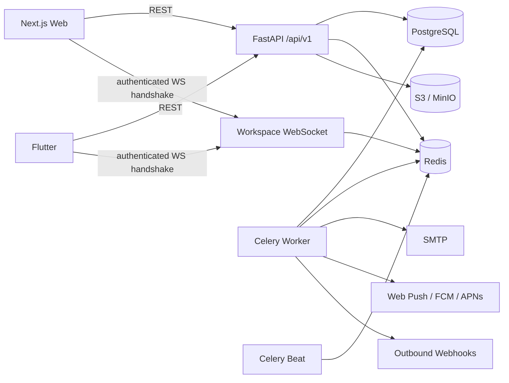

# TaskPilot

TaskPilot is a production-oriented collaborative project and task management platform for teams and individuals. It combines Trello-style boards, Linear-style task workflows, Asana-style planning, and Notion-style collaborative context in a single web + native mobile SaaS codebase.

The repository is intentionally built as a portfolio-grade system rather than a CRUD demo: multi-tenant authorization, realtime collaboration, optimistic concurrency, offline mobile mutations, object storage, background delivery, notifications, analytics, admin tooling, integrations, CI/CD, and production deployment are all implemented as working product paths.

## Product surface

### Web

The Next.js application includes:

- registration, login, refresh sessions, email verification, password reset, account deletion, and session/device management
- workspace onboarding, role management, invitations, ownership transfer, archive/restore, member removal, and guest isolation
- projects, Kanban boards, project overview, timeline, analytics, and templates
- task detail with Markdown descriptions, multiple assignees, labels, watchers, subtasks, dependencies, checklists, comments, mentions, reactions, attachments, custom fields, time tracking, and archive/restore
- My Tasks with assigned/created/watching/all scopes, saved views, filters, board/list modes, and archived task recovery
- calendar, search, command palette, recent items, and favorites
- notification inbox and notification preferences
- workspace settings, API tokens, outbound webhooks, account settings, and admin tooling
- responsive layouts, dark mode, empty/loading/error states, and accessible keyboard-oriented controls

### Flutter

The native Flutter client includes:

- authentication with secure token storage and refresh rotation
- workspace/project navigation and native Kanban boards
- task detail with editing, assignees, labels, watchers, dependencies, subtasks, checklists, comments, mentions, reactions, and task/comment attachments
- checklist assignment and ordering plus subtask-to-task conversion
- My Tasks, calendar, global search, notifications, project insights, account settings, and notification preferences
- offline mutation queue with retry/conflict handling and a Sync Center
- cached workspace/board/task data for useful offline reads
- realtime workspace updates over WebSockets
- archived-task browsing and restore
- optional FCM device registration and notification deep-link handling
- Android APK/AAB release builds in CI

The mobile app is native Flutter, not a WebView.

## Backend and collaboration

The FastAPI backend uses PostgreSQL, Redis, Celery, Alembic, and S3-compatible object storage.

Implemented backend domains include:

- users, sessions, account security, workspaces, invitations, members, and project-level guest access
- projects, columns, tasks, assignees, labels, watchers, comments, mentions, reactions, subtasks, dependencies, and checklists
- task optimistic concurrency through monotonic version numbers and HTTP 409 conflicts
- task archive/restore lifecycle with archived records excluded from normal task reads
- custom fields, saved views, favorites, recent items, templates, and time tracking
- S3/MinIO attachments with MIME validation, signed download URLs, quotas, and authorization
- permission-aware global search
- project planning, timeline data, workload/velocity/status analytics, activity feeds, and audit logs
- notification preferences, email delivery, Web Push, FCM/APNs provider support, digest scheduling, and delivery retries
- secure workspace invitation email delivery with encrypted one-time delivery tokens and background retries
- API tokens and signed outbound webhooks with retries
- platform admin metrics and management APIs

## Realtime design

Workspace realtime is Redis pub/sub backed and authorization is enforced before a socket subscribes to workspace events.

Access tokens are **not placed in WebSocket URLs**. Web and Flutter clients connect to:

```text
/api/v1/ws/workspaces/{workspace_id}
```

and immediately send an authentication frame:

```json
{"type":"auth","token":"<short-lived access token>"}
```

The server enforces a short authentication timeout, validates browser origins against configured CORS origins, verifies the user and workspace membership, and only then subscribes the socket to Redis.

## Architecture



See [docs/ARCHITECTURE.md](docs/ARCHITECTURE.md) for more detail.

## Repository layout

```text
TaskPilot/
├── backend/                 FastAPI, SQLAlchemy, Alembic, Celery, tests
├── web/                     Next.js, TypeScript, Tailwind, TanStack Query, dnd-kit
├── mobile/                  Flutter, Riverpod, Dio, GoRouter, secure/offline storage
├── docs/                    Architecture, deployment, workspace management
├── .github/workflows/       CI and Android release builds
├── docker-compose.yml       Local development stack
├── docker-compose.prod.yml  Production-oriented Compose stack
├── .env.example
├── .env.production.example
└── Makefile
```

## Authentication and authorization

- Passwords use Argon2 hashing.
- Access tokens are short-lived JWTs.
- Refresh tokens are opaque random values stored only as SHA-256 digests server-side.
- Refresh sessions rotate on refresh and can be revoked individually.
- Web refresh tokens use HttpOnly cookies.
- Mobile credentials use platform secure storage.
- Workspace, project, task, attachment, search, realtime, and integration APIs resolve authorization server-side.
- Guest users only see projects with explicit project membership.
- Admin endpoints require the independent platform `is_admin` flag.

A resource UUID is never treated as authorization proof.

## Files and object storage

TaskPilot uses S3-compatible object storage. Local development uses MinIO.

Attachments support:

- task and comment entities
- MIME and size validation
- workspace storage quotas
- signed download URLs
- protected metadata access
- delete authorization
- optional server-side encryption configuration

## Notifications

Notifications support:

- in-app inbox and read state
- per-kind preference matrix
- instant/hourly/daily email behavior
- browser Web Push
- FCM and APNs backend providers
- Flutter FCM token registration/refresh/revocation
- retryable delivery records
- deadline reminders through Celery Beat

Push credentials and Firebase client configuration remain deployment secrets and are not committed.

## Invitation delivery

Workspace invitations:

- are restricted by actor role
- expire after seven days
- only work for the matching account email
- store a SHA-256 validation digest
- keep the raw token out of audit logs and invitation listings
- use an encrypted one-time delivery copy for background SMTP delivery
- clear that encrypted copy after successful delivery
- retain a secure one-time creation link as a fallback when SMTP is unavailable

## Offline mobile behavior

Flutter supports queued offline mutations for conflict-safe operations. Queued changes are persisted per authenticated user and replayed when connectivity returns.

HTTP 409 conflicts are retained for explicit user resolution in the Sync Center rather than silently overwriting newer server state. Destructive or lifecycle-sensitive operations such as archive/restore and some advanced collaboration mutations remain online-only.

## Local setup

Requirements:

- Docker + Docker Compose
- optionally Python 3.12+, Node.js 22+, and Flutter stable for running services directly

Start the local stack:

```bash
cp .env.example .env
docker compose up --build
```

or:

```bash
make dev
```

Default local services:

- Web: `http://localhost:3000`
- API: `http://localhost:8000`
- OpenAPI: `http://localhost:8000/api/v1/docs`
- Health: `http://localhost:8000/health`
- MinIO console: `http://localhost:9001`

## Flutter development

The repository intentionally keeps generated Android host files out of source control. CI creates the Android host before building.

For local Android development:

```bash
cd mobile
flutter create . --platforms=android --project-name=taskpilot_mobile --org=dev.taskpilot
flutter pub get
flutter run --dart-define=API_URL=http://10.0.2.2:8000
```

Use an API address reachable by the device when testing on physical hardware.

FCM is runtime-optional. A deployment that wants native push must provide its Firebase platform configuration separately from source control and configure `FCM_SERVICE_ACCOUNT_JSON` on the backend.

## Testing

Backend:

```bash
cd backend
pip install '.[dev]'
ruff check app tests
pytest -q
```

CI also verifies the complete Alembic chain by upgrading from an empty database, downgrading to base, and upgrading again.

Web:

```bash
cd web
npm install
npm run lint
npm test
npm run typecheck
npm run build
```

Flutter:

```bash
cd mobile
flutter pub get
flutter analyze
flutter test
```

Backend tests cover account lifecycle, authorization/isolation, collaboration, attachments, planning/analytics, productivity, notifications, integrations, templates, rate limiting, admin security, and multi-user API flows.

## CI/CD

`.github/workflows/ci.yml` gates pull requests and `main` with six production-oriented jobs:

1. backend Ruff, Alembic upgrade/downgrade verification, and pytest
2. web production dependency audit, lint, Vitest, TypeScript typecheck, and Next.js build
3. real Chromium E2E against FastAPI + PostgreSQL + Redis, covering registration → onboarding → project → task creation
4. Flutter analyze/tests plus release APK and AAB builds
5. Flutter analyze/tests plus unsigned iOS release build on macOS
6. production Compose validation plus backend/web Docker image builds

Android artifacts are uploaded as `taskpilot-android`; the unsigned iOS `Runner.app` is uploaded as `taskpilot-ios-unsigned`. Playwright reports/traces are uploaded on E2E runs for failure analysis.

The web runtime gate uses `npm audit --omit=dev --audit-level=high`. TaskPilot currently pins Next.js 16.3.5 so the high-severity PostCSS advisory previously reported through Next's bundled dependency is not accepted by CI.

Store signing credentials must be supplied through CI secrets before Play Store or App Store publication; no keystore, certificate, provisioning profile, or signing password belongs in the repository. The unsigned iOS contributor gate stays in `ci.yml`; production archive/IPA/TestFlight automation is documented in [docs/IOS_RELEASE.md](docs/IOS_RELEASE.md).

## Production deployment

TaskPilot includes `docker-compose.prod.yml` and a production environment template.

The production stack provides:

- one-shot database migrations before service startup
- non-root application containers
- health-gated dependencies
- persistent PostgreSQL/Redis/object-storage volumes
- loopback-only public service bindings by default
- Celery worker and Beat processes
- configurable concurrency
- startup rejection for unsafe default production secrets

Use a TLS-terminating reverse proxy or managed load balancer in front of web/API/object storage. PostgreSQL and Redis should not be internet-accessible.

See [docs/DEPLOYMENT.md](docs/DEPLOYMENT.md).

## Security posture

Implemented safeguards include:

- Argon2 password hashing
- short-lived access tokens
- refresh-token hashing, rotation, expiry, and revocation
- HttpOnly web refresh cookies
- secure headers including HSTS in production, CSP frame restrictions, MIME sniffing protection, and restrictive referrer policy
- Redis-backed rate limits on sensitive authentication/account/upload operations
- strict CORS configuration
- browser WebSocket Origin validation
- token-free WebSocket URLs
- server-side authorization and guest isolation
- optimistic conflict detection
- Pydantic validation and ORM parameter binding
- signed object-storage URLs and attachment validation
- encrypted push subscription targets/configuration
- signed outbound webhooks
- hashed invitation/API tokens
- audit logs that intentionally exclude credentials/tokens
- production startup guards against unsafe default secrets

## Remaining work

The core product is implemented. Remaining work is mostly release/operations depth rather than missing CRUD features:

- expand Playwright coverage beyond the current real registration → onboarding → project → task smoke journey into multi-user comments, permissions, archive/restore, and integration flows
- broader Flutter widget/integration tests and device-level offline/reconnect scenarios
- signed iOS archive/App Store release workflow (unsigned release compilation is already gated in CI)
- production Firebase/APNs platform configuration and real-device push validation
- centralized error monitoring, log aggregation, uptime alerting, and SLO dashboards
- OAuth providers if required by the target deployment
- polished portfolio screenshots/demo dataset and public hosted demo
- final licensing decision before external distribution
- optional AI assistance only after the core platform remains stable under production use

## Portfolio intent

TaskPilot demonstrates a realistic SaaS architecture across backend, responsive web, and native mobile clients: multi-tenant authorization, realtime events, background workers, secure authentication, object storage, notifications, integrations, optimistic concurrency, offline sync/conflict handling, analytics, admin operations, Docker, migrations, and CI/CD.

## License

No license has been selected yet.
