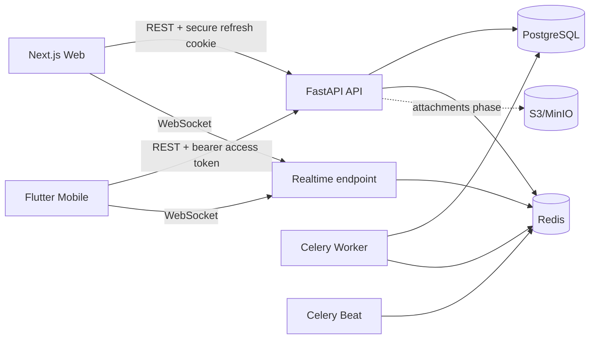

# TaskPilot Architecture

TaskPilot is a monorepo with three clients/services that share a versioned HTTP and WebSocket contract.

## Security boundaries

Every workspace-scoped API resolves membership on the server. Client-provided workspace/project/task IDs are never accepted as authorization proof. Access tokens are short-lived. Refresh tokens are opaque, hashed at rest, rotated on refresh, revocable per session, and stored as HttpOnly cookies on web or secure storage on mobile.

## Collaboration

Tasks carry a monotonic `version`. Mutating endpoints compare the version supplied by the client and return HTTP 409 on conflict. Board moves are optimistic on clients and are broadcast over workspace-authorized Redis pub/sub WebSocket channels.

## Data model status

The first production slice implements users, sessions, workspaces, workspace membership/invitations schema, projects, board columns, tasks, assignees schema, labels schema, comments, notifications, and activity logs. The wider product schema in the roadmap will be added through Alembic migrations rather than direct database edits.

## Scaling path

The API is stateless except for database/Redis dependencies and can be horizontally scaled. Redis pub/sub decouples realtime events from individual API workers. Celery handles scheduled/background work. PostgreSQL remains the source of truth; authorization decisions are intentionally not cached in this phase to avoid stale permissions.
