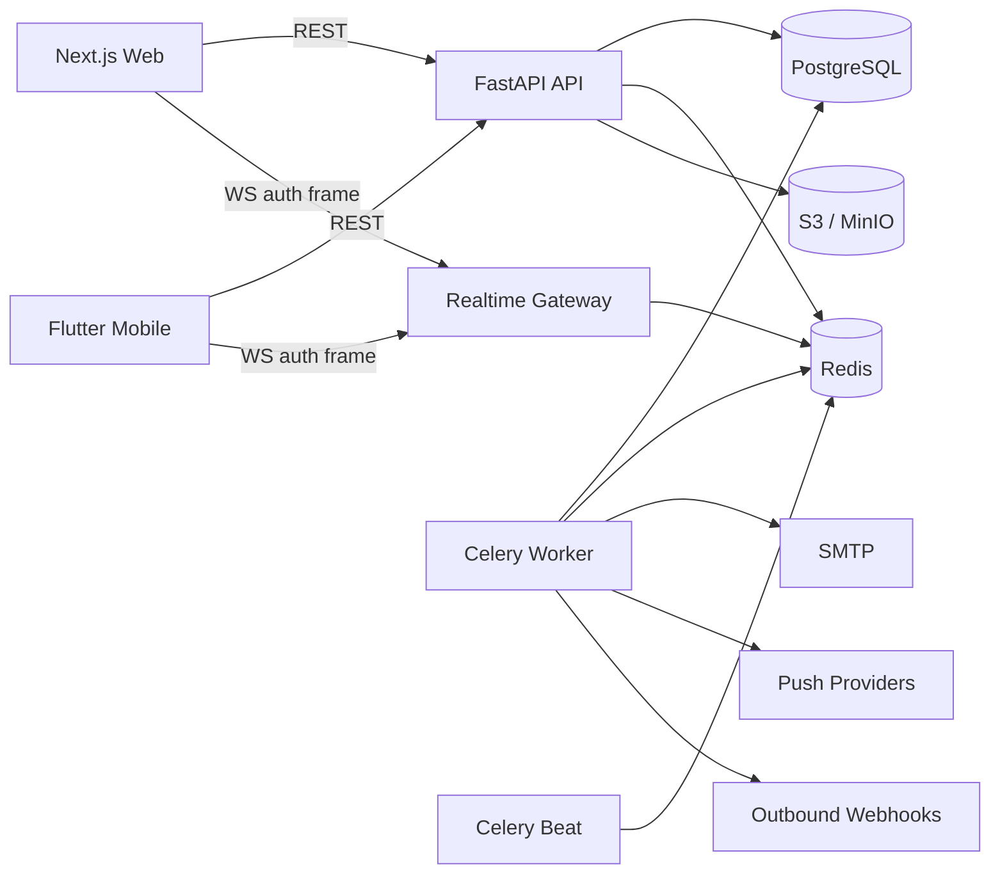

# TaskPilot Architecture

TaskPilot is a monorepo containing a FastAPI backend, a Next.js web application, and a native Flutter application. PostgreSQL is the source of truth, Redis provides realtime/pub-sub plus Celery transport, S3-compatible object storage holds attachments, and Celery workers perform scheduled/delayed delivery work.

## System topology



## HTTP and session model

Web and mobile share the versioned `/api/v1` REST contract.

Access tokens are short-lived JWTs. Refresh sessions use random opaque values; only their SHA-256 digests are persisted. Web stores the refresh token in an HttpOnly cookie scoped to the auth routes. Mobile stores refresh/access credentials in platform secure storage.

Session refresh rotates the refresh token. Expired or revoked sessions cannot issue a new access token.

## Authorization boundaries

Authorization is resolved server-side for every workspace-scoped resource.

The effective hierarchy is:

```text
user
  -> workspace membership
      -> optional project-level guest membership
          -> project
              -> task/collaboration/attachment resources
```

Workspace roles are owner, admin, member, and guest. Guests require an explicit project membership to access project data. Platform admin authorization is separate from workspace roles.

Resource identifiers never grant access on their own.

## Realtime

Realtime events use Redis pub/sub channels scoped by workspace.

The WebSocket endpoint does not accept access tokens in the URL. After connection, the client must send:

```json
{"type":"auth","token":"<access token>"}
```

The server:

1. optionally validates the browser `Origin` against configured CORS origins
2. requires the auth frame within five seconds
3. decodes the access token
4. verifies the user is active
5. verifies workspace authorization
6. only then subscribes to the Redis workspace channel

This avoids exposing access tokens to reverse-proxy or access-log query strings.

## Collaboration and concurrency

Tasks carry a monotonic integer `version`.

Conflict-sensitive update/move operations include the version expected by the client. If the persisted task changed first, the API returns HTTP 409 rather than silently overwriting another collaborator.

Web clients use optimistic updates for responsive board interactions. Flutter additionally persists selected offline mutations and surfaces conflicts through its Sync Center.

Workspace realtime events cover task and collaboration changes so connected clients can refetch affected state.

## Task collaboration model

Task collaboration includes:

- multiple assignees
- workspace labels
- watchers
- subtasks and subtask conversion
- task dependencies
- multiple checklists
- checklist assignment and ordering
- rich comments
- mentions and reactions
- task and comment attachments
- custom fields
- time tracking
- archive/restore lifecycle

Archived tasks remain in the database but are excluded from ordinary task reads. A separate permission-aware archive query supports recovery.

## Files

Attachment metadata is stored in PostgreSQL; bytes are stored in S3-compatible object storage.

Upload authorization is resolved against the owning task/comment workspace. The attachment service enforces configured size/MIME rules and workspace quotas. Downloads use short-lived signed URLs so the object store does not need to expose permanent public objects.

MinIO implements this contract locally and in the bundled Compose stacks; a managed compatible provider can replace it through environment configuration.

## Background processing

Celery handles background work including:

- deadline reminder generation
- notification dispatch and retry
- hourly/daily notification digests
- workspace invitation email delivery
- outbound webhook delivery/retry

Celery Beat schedules recurring dispatch work. PostgreSQL remains the source of truth for delivery status; Redis is transport/runtime infrastructure rather than the authoritative record.

## Notification delivery

Notifications are persisted in-app first. Delivery preferences then decide whether email or push delivery records should be created.

Push subscriptions store encrypted targets/configuration. Backends exist for Web Push, FCM, and APNs. Flutter can register/revoke FCM device tokens when a Firebase client configuration is present.

Workspace invitation email delivery follows a separate secure path: the validation token is hashed, while an encrypted one-time delivery copy is retained only until successful SMTP delivery.

## Integrations

Personal API tokens are hashed at rest and shown only on creation.

Outbound webhooks use signing secrets and persisted delivery attempts. Worker retries do not bypass workspace/integration authorization established when the endpoint is created.

## Security controls

Important platform controls include:

- Argon2 password hashing
- refresh token digests and rotation
- production secret validation
- strict CORS
- security response headers
- browser WebSocket Origin checks
- no access token in WebSocket URLs
- Redis-backed sensitive-route rate limits
- signed object downloads
- encrypted push destinations
- webhook signatures
- audit logs without secrets/tokens
- permission-aware search and admin separation

## Scaling path

The API is stateless outside PostgreSQL/Redis/object storage and can be replicated horizontally. All API instances must share Redis for realtime and Celery.

For larger deployments:

- move PostgreSQL, Redis, and object storage to managed/dedicated infrastructure
- tune API/Celery concurrency based on measured database pressure
- run a single Celery Beat scheduler
- place a WebSocket-capable TLS proxy/load balancer at the edge
- centralize logs/metrics/errors outside the application containers
- preserve server-side authorization as the source of truth instead of caching permissions in clients
